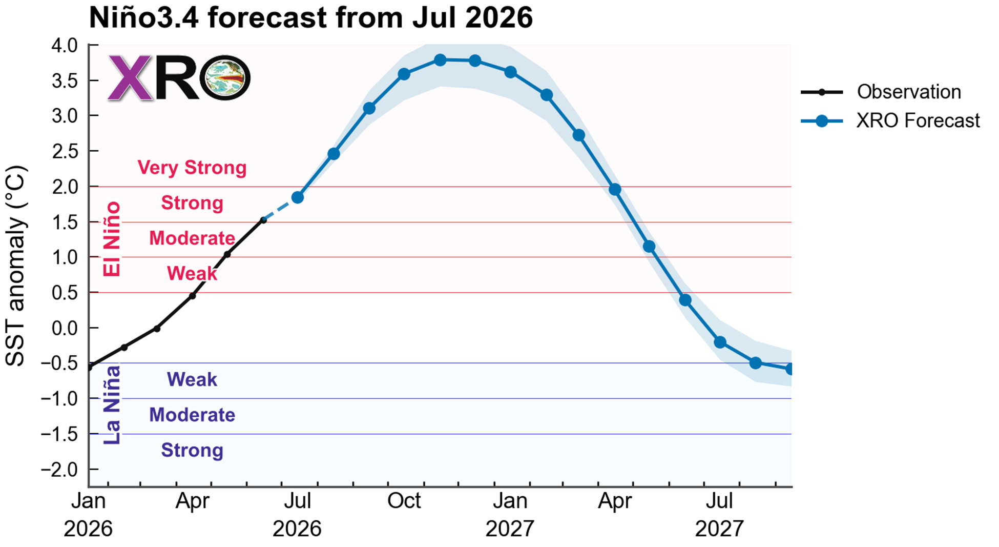
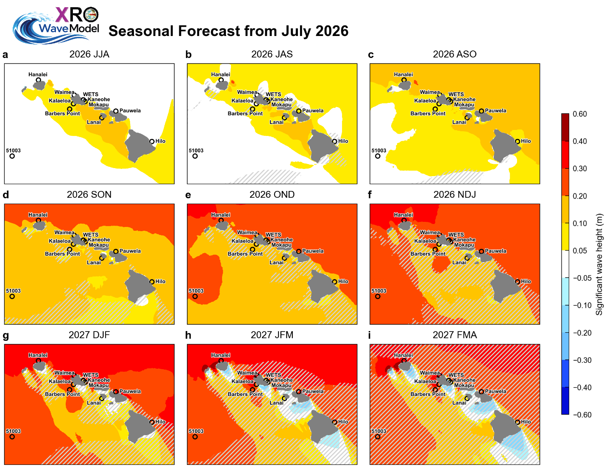
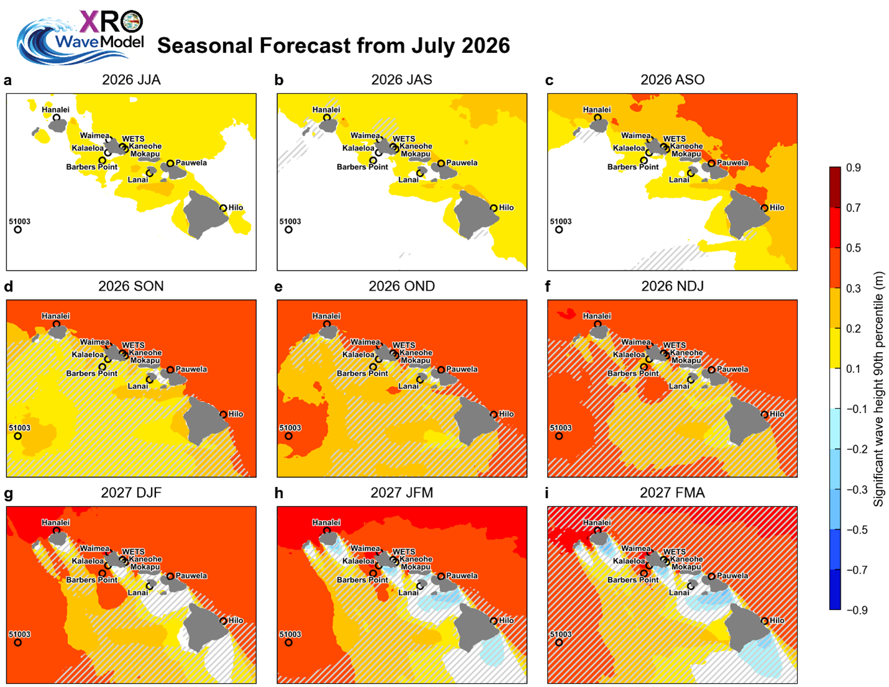

## Seasonal ENSO Forecast
El Niño conditions are currently intensifying across the tropical Pacific, with SST anomalies in the Niño3.4 region (5°S–5°N, 120°–170°W) showing a steady upward trend. The observed SST anomaly reached 1.5°C in June 2026, placing a Strong El Niño level. Our XRO forecast Niño3.4 anomalies exceeding +2.0°C by Jul-Sep 2026, reaching peak 3.7°C by Nov-Dec 2026, providing a high level of confidence of an unprecedented super El Niño event since 1950 characterized by significant warming in the central and eastern tropical Pacific (Figure 1).

{#fig1}
/// caption
Figure 1. Seasonal ENSO observations from January to June 2026 and XRO ENSO forecasts from July 2026 to August 2017, based on the Niño3.4 sea surface temperature (SST) anomalies (120-170W, 5S-5N, °C).
///

## Hawaii Wave Seasonal Outlook
The development of a super El Niño is expected to substantially modulate significant wave height (SWH) around the Hawaiian Islands over the coming seasons. Figures 2 and 3 show forecasts of seasonally mean and 90th-percentile SWH anomalies, respectively, from June-August (JJA) 2026 through early February-April (FMA) 2027. Positive SWH anomalies, indicative of enhanced wave activity, are already emerging in the coastal waters around Hawaii in JJA 2026 (Figs. 2a and 3a). These seasonal anomalies are expected to intensify progressively through boreal fall and winter as El Niño matures. The largest positive anomalies north of the islands could exceed +0.4 m in mean SWH and +0.6 m in the 90th percentile for NDJ 2026 through JFM 2027.

The projected increase in wave heights around Hawaii is consistent with a strengthened North Pacific jet stream, an equatorward-shift of the storm track, and enhanced high-latitude swell generation, all of which are characteristics of strong El Niño winters (Stopa & Cheung, 2014; Zhao et al. 2025). In contrast, outlooks for south- and southeast-facing shores indicate weaker  anomalies throughout the forecast period, although the forecast skill in these regions is comparatively lower.

{#fig2}
/// caption
Figure 2. Seasonal mean significant wave height anomaly outlook issued in July 2026 from the XROWaveModel. Hatched areas denote regions where the corresponding hindcast anomaly correlation coefficient (ACC) evaluated over the 1980–2024 period, is below 0.5, suggesting reduced forecast skill and lower confidence in the predicted anomalies.
///

{#fig3}
/// caption
Figure 3. Outlook of seasonal 90th percentile significant wave height anomalies (m) issued in July 2026 from the XROWaveModel. Hatched areas denote regions where the corresponding hindcast anomaly correlation coefficient (ACC) evaluated over the 1980–2024 period, is below 0.5, suggesting reduced forecast skill and lower confidence in the predicted anomalies.
///

