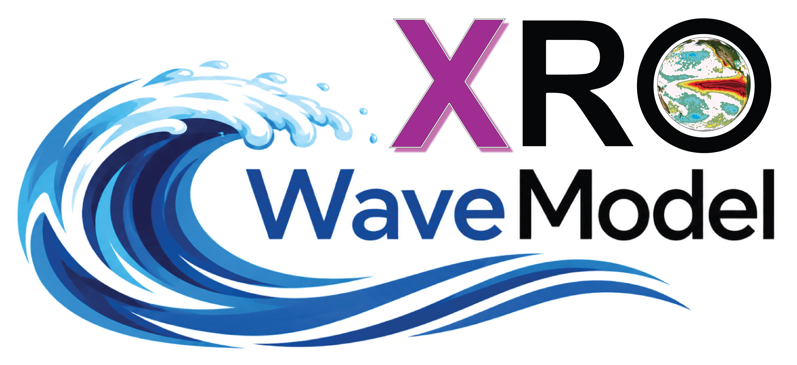
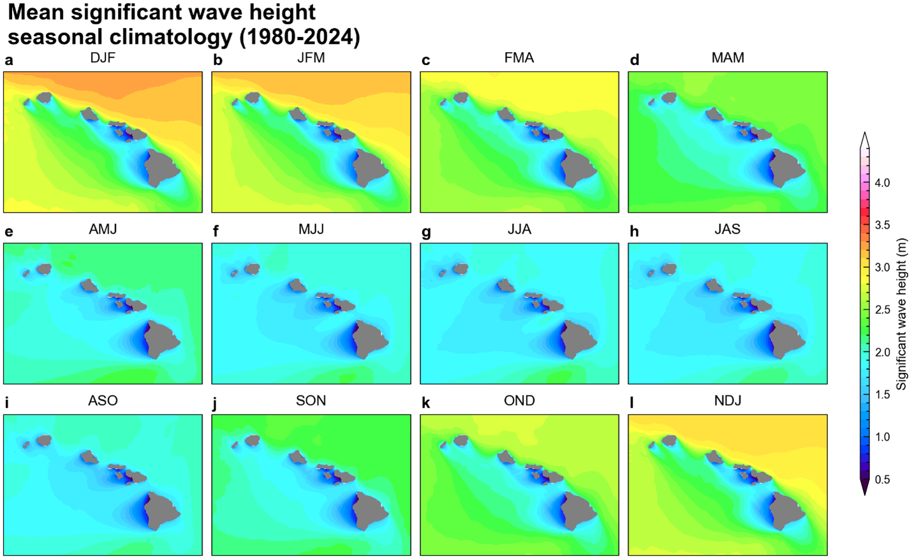
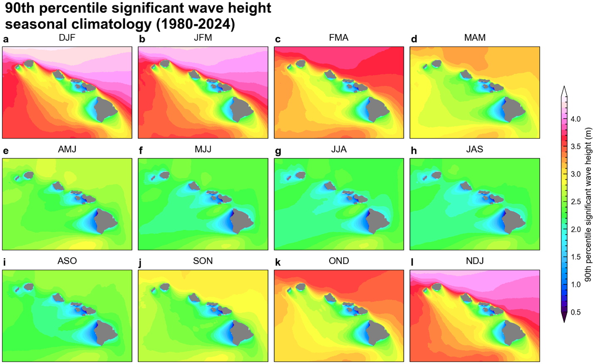

{#logo}

Hawaiʻi experiences multimodal seas, with independent wave systems generated from different source regions (Li et al., 2016). The complex wave climate demonstrates significant spatial-temporal variability across the islands as shown in Figure 1 and 2 for the seasonal mean and 90th percentile significant wave height (SWH). Previous studies have demonstrated a strong connection between large-scale climate variability and wave activity in subtropical regions based on low-resolution global wave hindcasts (Boucharel et al., 2021; Bromirski et al., 2013; Echevarria et al., 2020; Izaguirre et al., 2011; Kumar et al., 2022; Odériz et al., 2021, 2020; Stopa and Cheung, 2014). In this study, we further investigate the impact of global climate modes on Hawaii's coastal waves using a high-resolution hindcast data set from 1980 to 2024 to elucidate their distinct relationships with near‐shore wave activities. We had identified the El Niño–Southern Oscillation (ENSO) as the primary and the Pacific Decadal Oscillation (PDO) as the secondary climate modes influencing seasonal wave anomalies around the Hawaiian Islands.

Researchers at the University of Hawaiʻi recently developed an eXtended nonlinear Recharge Oscillator (XRO) model that provides skillful ENSO forecasts with lead times of up to 16–18 months (Zhao et al., 2024). The XRO model predicts ENSO evolution by explicitly accounting for interactions among the tropical Pacific, Indian, Atlantic, and extratropical Pacific Oceans. It has demonstrated forecast skill that exceeds many global climate models and is comparable to state-of-the-art artificial intelligence–based forecasting systems.

By combining the XRO model's long-lead ENSO predictions with the historical relationships between large-scale climate variability and Hawaiian wave conditions (Zhao et al., 2025), we developed the XRO Coupled Wave Model (XROWaveModel) to produce seasonal outlooks of SWH anomalies around the Hawaiian Islands.

Forecast confidence varies by region and season and is quantified using the anomaly correlation coefficient (ACC) derived from retrospective forecasts over the 1980–2024 period.  In the monthly updated forecast maps, positive anomalies indicate significant wave heights exceeding the climatological average, while negative anomalies indicate below-normal wave conditions. Hatched regions denote areas where the hindcast ACC is less than 0.5, indicating reduced forecast skill and lower confidence. Conversely, forecasts in non-hatched regions have demonstrated higher historical skill and therefore carry greater confidence.

These seasonal wave outlooks represent three-month mean wave conditions and are intended to characterize broad climate-driven wave anomalies rather than individual storms or short-term wave variability.

{#fig1}
/// caption
Figure 1. Mean significant wave height seasonal climatology during 1980-2024.
///

{#fig2}
/// caption
Figure 2. 90th percentile significant wave height seasonal climatology during 1980-2024.
///